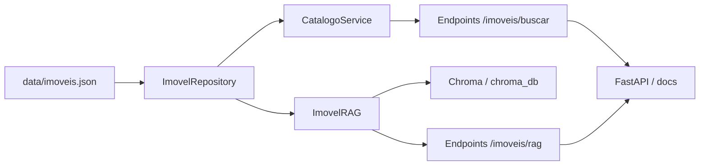

# SDR Imobiliário AI

## Visão Geral

Projeto de POC para um Agente SDR Imobiliário com IA Generativa. A solução cobre catálogo de imóveis, busca estruturada, busca semântica com RAG e exposição via API FastAPI.

## Arquitetura da Solução



### Componentes

- [data/imoveis.json](data/imoveis.json): base simulada de imóveis.
- [app/catalogo/models.py](app/catalogo/models.py): modelos de domínio e payloads de busca.
- [app/catalogo/repository.py](app/catalogo/repository.py): leitura da base de dados.
- [app/catalogo/service.py](app/catalogo/service.py): filtros estruturados e regras de negócio.
- [app/catalogo/rag.py](app/catalogo/rag.py): geração de documentos, embeddings, indexação e reranking.
- [app/api/imoveis.py](app/api/imoveis.py): endpoints da API.

## Fluxo do Pipeline RAG

1. Carrega os imóveis do JSON.
2. Monta documentos ricos com título, bairro, preço, finalidade, quartos e descrição.
3. Gera embeddings com `BAAI/bge-m3`.
4. Armazena os vetores no Chroma (`chroma_db`).
5. Executa busca vetorial, filtros estruturados e reranking.
6. Retorna a resposta em JSON.

## Executando o projeto

### 1. Criar ambiente virtual

python -m venv .venv

### 2. Ativar

Windows:

.venv\Scripts\activate

### 3. Instalar dependências

pip install -r requirements.txt

### 4. Rodar API

uvicorn app.main:app --reload

### 5. Documentação

http://localhost:8000/docs

### 6. Indexar a base de imóveis

python scripts/indexar_imoveis.py

Para reindexar do zero:

python scripts/indexar_imoveis.py --reindexar

Para indexar sem a validação final:

python scripts/indexar_imoveis.py --sem-validacao


# Catálogo de imóveis

## Listar imóveis

GET /imoveis/

Resposta: lista de imóveis disponíveis na base.

## Buscar imóvel

GET /imoveis/{imovel_id}

Retorna um imóvel específico pelo ID ou 404 se não existir.

## Buscar imóveis com filtros

POST /imoveis/buscar

Exemplo:

```json
{
    "finalidade": "compra",
    "tipo": "apartamento",
    "bairro": "Moema",
    "preco_max": 800000,
    "quartos_min": 2
}
```

## Busca semântica / RAG

POST /imoveis/rag

Exemplo:

```json
{
        "consulta": "imóvel moderno para investimento",
        "limite": 3
}
```

Exemplo com filtros estruturados:

```json
{
        "consulta": "imóvel para família com muitos quartos",
        "limite": 3,
        "filtros": {
                "quartos_min": 3,
                "finalidade": "compra"
        }
}
```

### Resposta do RAG

```json
{
    "consulta": "imóvel moderno para investimento",
    "quantidade": 3,
    "resultados": [
        {
            "imovel_id": 4,
            "titulo": "Casa residencial no Morumbi",
            "finalidade": "compra",
            "quartos": 4,
            "preco": 1200000,
            "conteudo": "..."
        }
    ]
}
```

## Pipeline de Dados

- A base de imóveis fica em `data/imoveis.json`.
- O repositório carrega os dados e transforma cada item em um modelo `Imovel`.
- O RAG converte imóveis em documentos de contexto para a busca semântica.
- O Chroma persiste os embeddings localmente em `chroma_db`.

## Qualidade da Busca

- Busca estruturada por finalidade, tipo, cidade, bairro, preço, quartos e vagas.
- Busca semântica com embeddings.
- Reranking para melhorar a relevância dos resultados.
- Dedução de intenção em consultas como "família com muitos quartos".

## Demonstração

Para validar a busca semântica fora da API, execute:

python teste_rag.py

O script imprime a resposta em JSON.