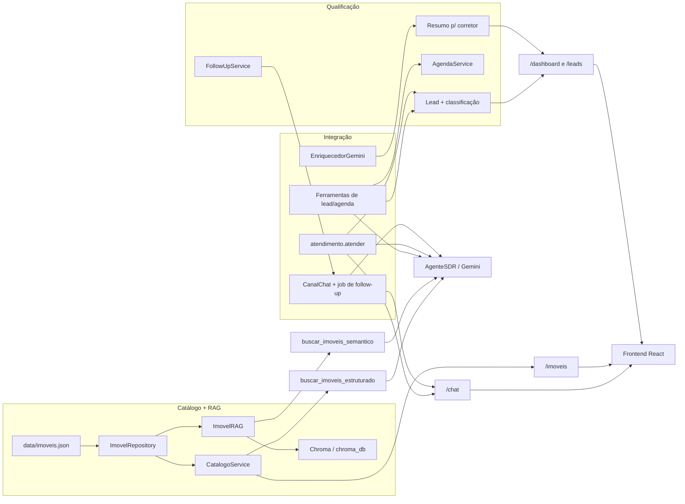

# SDR Imobiliário AI

## Visão Geral

Projeto de POC para um Agente SDR Imobiliário com IA Generativa. A solução cobre catálogo de imóveis, busca estruturada, busca semântica com RAG, um agente de chat (Bia) com LLM via Gemini, qualificação de leads (classificação, agendamento, follow-up e resumo para o corretor), e exposição via API FastAPI + interface web em React com painel do corretor.

## Arquitetura da Solução



### Componentes

- [backend/data/imoveis.json](backend/data/imoveis.json): base simulada de imóveis.
- [backend/app/catalogo/models.py](backend/app/catalogo/models.py): modelos de domínio e payloads de busca.
- [backend/app/catalogo/repository.py](backend/app/catalogo/repository.py): leitura da base de dados.
- [backend/app/catalogo/service.py](backend/app/catalogo/service.py): filtros estruturados e regras de negócio.
- [backend/app/catalogo/rag.py](backend/app/catalogo/rag.py): geração de documentos, embeddings, indexação e reranking.
- [backend/app/catalogo/instancias.py](backend/app/catalogo/instancias.py): instâncias únicas do serviço de catálogo e do RAG, compartilhadas entre API e agente.
- [backend/app/api/imoveis.py](backend/app/api/imoveis.py): endpoints do catálogo.
- [backend/app/agente/agente.py](backend/app/agente/agente.py): `AgenteSDR`, sessão de chat por cliente usando o SDK do Gemini (`google-genai`).
- [backend/app/agente/prompts.py](backend/app/agente/prompts.py): system prompt da Bia (persona, tom de voz, regras de negócio).
- [backend/app/agente/tools.py](backend/app/agente/tools.py): ferramentas (function calling) que o Gemini pode acionar para consultar o catálogo, estruturado ou semântico.
- [backend/app/api/chat.py](backend/app/api/chat.py): endpoints do chat.
- [backend/app/qualificacao/](backend/app/qualificacao/): qualificação de leads, classificação, agendamento, follow-up e resumo para o corretor (ver seção própria abaixo).
- [backend/app/api/leads.py](backend/app/api/leads.py): endpoints de leads, agendamento e follow-up.
- [backend/app/integracao/](backend/app/integracao/): cola entre os módulos — transforma cada conversa em lead, dá à Bia ferramentas de qualificação/agenda, dispara o follow-up e gera o resumo com IA (ver seção "Interface e Integração").
- [backend/app/api/dashboard.py](backend/app/api/dashboard.py): endpoints do painel do corretor.
- [frontend/src/components/ChatWidget.jsx](frontend/src/components/ChatWidget.jsx): widget de chat flutuante que conversa com a Bia.
- [frontend/src/pages/DashboardPage.jsx](frontend/src/pages/DashboardPage.jsx): painel do corretor (métricas, leads, agendamentos, resumo e follow-up).
- [frontend/src/lib/](frontend/src/lib/): cliente da API, formatação e rótulos usados pelas páginas.

## Agente de Chat (LLM)

A Bia é o agente conversacional do projeto: um SDR virtual que atende pelo chat, entende o que o cliente procura e busca imóveis reais do catálogo para responder.

- **Modelo**: Google Gemini (`gemini-2.5-flash` por padrão), via SDK `google-genai`.
- **Contexto**: cada `sessao_id` mantém sua própria sessão de chat em memória (`AgenteSDR._sessoes`), preservando o histórico da conversa entre mensagens.
- **Function calling**: o modelo decide sozinho quando chamar `buscar_imoveis_estruturado` (critérios exatos: finalidade, tipo, cidade, bairro, preço, quartos, vagas) ou `buscar_imoveis_semantico` (pedidos vagos/descritivos, usa o pipeline de RAG).
- **Regras de negócio**: o prompt (`prompts.py`) proíbe o modelo de inventar imóveis, preços ou características — só pode descrever o que as ferramentas retornaram na conversa.

### Configuração

Crie um arquivo `.env` em `backend/` com:

```
GEMINI_API_KEY=sua_chave_da_api_do_gemini
GEMINI_MODEL=gemini-2.5-flash
```

Sem `GEMINI_API_KEY`, os endpoints de chat respondem `503`.

### Endpoints do chat

- `POST /chat/`: envia uma mensagem (`sessao_id`, `mensagem`) e recebe a resposta da Bia.
- `GET /chat/{sessao_id}/historico`: retorna o histórico da sessão.
- `POST /chat/{sessao_id}/reiniciar`: descarta o contexto da sessão.

Também é possível conversar com a Bia direto pelo terminal:

```
cd backend
python scripts/chat_cli.py
```

## Fluxo do Pipeline RAG

1. Carrega os imóveis do JSON.
2. Monta documentos ricos com título, bairro, preço, finalidade, quartos e descrição.
3. Gera embeddings com `BAAI/bge-m3`.
4. Armazena os vetores no Chroma (`chroma_db`).
5. Executa busca vetorial, filtros estruturados e reranking.
6. Retorna a resposta em JSON.

## Executando o projeto

Backend e frontend ficam em pastas separadas: `backend/` e `frontend/`.

> [!IMPORTANT]
> **O projeto precisa de uma chave de API do Gemini para funcionar.** Antes de
> rodar o backend, coloque sua chave no arquivo `backend/.env` (passo 5 abaixo).
> Sem ela, a Bia não responde (o chat retorna erro `503`) e o resumo com IA e o
> follow-up gerado pela Bia ficam indisponíveis. A chave pode ser gerada
> gratuitamente em https://aistudio.google.com/apikey. Se a API retornar
> `429 RESOURCE_EXHAUSTED`, a cota ou o limite de gastos do projeto da chave
> acabou: ajuste em https://ai.studio/spend ou use outra chave.

### Backend

### 1. Entrar na pasta

cd backend

### 2. Criar ambiente virtual

python -m venv .venv

### 3. Ativar

Windows:

.venv\Scripts\activate

### 4. Instalar dependências

pip install -r requirements.txt

### 5. Configurar a chave da API

Crie (ou edite) o arquivo `backend/.env` com a sua chave do Gemini:

```
GEMINI_API_KEY=sua_chave_da_api_do_gemini
GEMINI_MODEL=gemini-2.5-flash
```

Não compartilhe a chave nem a envie para o repositório.

### 6. Rodar API

uvicorn app.main:app --reload

### 7. Documentação

http://localhost:8000/docs

### 8. Indexar a base de imóveis

python scripts/indexar_imoveis.py

Para reindexar do zero:

python scripts/indexar_imoveis.py --reindexar

Para indexar sem a validação final:

python scripts/indexar_imoveis.py --sem-validacao

### Frontend

Requer Node.js 20.19+ (ou 22.12+), exigência do Vite 8.

cd frontend
npm install
npm run dev

Acesse http://localhost:5173 (site + chat) e http://localhost:5173/dashboard (painel do corretor).


# Catálogo de imóveis

## Listar imóveis

GET /imoveis/

Resposta: lista de imóveis disponíveis na base.

## Buscar imóvel

GET /imoveis/{imovel_id}

Retorna um imóvel específico pelo ID ou 404 se não existir.

## Buscar imóveis com filtros

POST /imoveis/buscar

Exemplo:

```json
{
    "finalidade": "compra",
    "tipo": "apartamento",
    "bairro": "Moema",
    "preco_max": 800000,
    "quartos_min": 2
}
```

## Busca semântica / RAG

POST /imoveis/rag

Exemplo:

```json
{
        "consulta": "imóvel moderno para investimento",
        "limite": 3
}
```

Exemplo com filtros estruturados:

```json
{
        "consulta": "imóvel para família com muitos quartos",
        "limite": 3,
        "filtros": {
                "quartos_min": 3,
                "finalidade": "compra"
        }
}
```

### Resposta do RAG

```json
{
    "consulta": "imóvel moderno para investimento",
    "quantidade": 3,
    "resultados": [
        {
            "imovel_id": 4,
            "titulo": "Casa residencial no Morumbi",
            "finalidade": "compra",
            "quartos": 4,
            "preco": 1200000,
            "conteudo": "..."
        }
    ]
}
```

## Pipeline de Dados

- A base de imóveis fica em `backend/data/imoveis.json`.
- O repositório carrega os dados e transforma cada item em um modelo `Imovel`.
- O RAG converte imóveis em documentos de contexto para a busca semântica.
- O Chroma persiste os embeddings localmente em `chroma_db`.

## Qualidade da Busca

- Busca estruturada por finalidade, tipo, cidade, bairro, preço, quartos e vagas.
- Busca semântica com embeddings.
- Reranking para melhorar a relevância dos resultados.
- Dedução de intenção em consultas como "família com muitos quartos".

## Demonstração

Para validar a busca semântica fora da API, execute:

cd backend
python teste_rag.py

O script imprime a resposta em JSON.

# Qualificação de Leads (Qualificação + Automação)

Módulo responsável pela lógica comercial do SDR: o que perguntar a seguir,
como classificar o lead (quente/morno/frio), agendamento de reuniões/visitas,
follow-up de leads inativos e o resumo estruturado para o corretor.

Fica isolado em [backend/app/qualificacao/](backend/app/qualificacao/) e é
consumido pelos outros módulos via funções/serviços — sem acoplamento com
prompt/LLM (Pessoa 1), catálogo/RAG (Pessoa 2) ou interface (Pessoa 4).

## Responsabilidades

- **Modelo do lead e qualificação** ([models.py](backend/app/qualificacao/models.py), [campos.py](backend/app/qualificacao/campos.py), [qualificacao.py](backend/app/qualificacao/qualificacao.py)): entidade `Lead`, campos obrigatórios por intenção (declarados em [config.py](backend/app/qualificacao/config.py)), cálculo do próximo campo a perguntar e merge de dados extraídos sem apagar histórico.
- **Classificação** ([classificacao.py](backend/app/qualificacao/classificacao.py)): pontuação explicável (urgência, completude dos dados, faixa de valor definida, intenção clara, engajamento recente, penalidade por follow-up sem resposta) que resulta em quente/morno/frio + motivos.
- **Agendamento** ([agendamento.py](backend/app/qualificacao/agendamento.py)): agenda simulada de slots (corretor/especialista), sem conflito de horário, com roteamento automático (lead de investimento → especialista; lead com imóvel de interesse → visita; demais → corretor).
- **Follow-up** ([followup.py](backend/app/qualificacao/followup.py)): identifica leads elegíveis para a próxima tentativa (intervalos e número máximo configuráveis), templates de mensagem por tentativa, e encerra (inativa) o lead ao esgotar as tentativas.
- **Resumo para o corretor** ([resumo.py](backend/app/qualificacao/resumo.py)): resumo estruturado determinístico (sem depender de LLM), com ponto de extensão opcional para enriquecer com um cliente LLM injetado.

## Interfaces públicas (o que outros módulos chamam)

**Pessoa 1 (Agente/LLM)** — depois de extrair dados da conversa, envia um
`DadosExtraidosLead` (todos os campos opcionais) para atualizar o lead, e usa
`campos_faltantes`/`proximo_campo_prioritario` para saber o que perguntar a
seguir (a frase da pergunta é responsabilidade dela, não deste módulo):

```python
from app.qualificacao.qualificacao import criar_lead, atualizar_lead
from app.qualificacao.campos import proximo_campo_prioritario
from app.qualificacao.models import DadosExtraidosLead
from app.qualificacao.instancias import lead_repository, relogio

lead = criar_lead(lead_repository, lead_id, canal="whatsapp", contato="+55...", relogio=relogio)

lead = atualizar_lead(
    lead_repository,
    lead_id,
    DadosExtraidosLead(intencao="compra", regiao="Moema"),
    relogio=relogio,
)

proximo_campo_prioritario(lead)  # -> "preco_max", por exemplo, ou None se já está tudo
```

**Pessoa 2 (Imóveis + RAG)** — nenhuma dependência direta. O lead só guarda
`imovel_interesse_id` (um `int`), sem validar contra o catálogo.

**Pessoa 4 (Interface + integração)** — pode chamar os serviços Python
diretamente (mesmo processo) ou usar a API REST em `/leads` (registrada em
`main.py`, mesmo padrão de `/imoveis` e `/chat`):

- `POST /leads/` — cria lead (`canal`, `contato`, `id` opcional).
- `GET /leads/` — lista leads. `GET /leads/{id}` — obtém um lead.
- `PATCH /leads/{id}` — atualiza com `DadosExtraidosLead`.
- `GET /leads/{id}/proximo-campo` — próximo campo a perguntar + campos faltantes.
- `GET /leads/{id}/classificacao` — reclassifica e retorna temperatura + motivos.
- `GET /leads/{id}/resumo` — resumo estruturado para o corretor.
- `GET /leads/agendamentos/slots?tipo=` — slots disponíveis.
- `POST /leads/{id}/agendamentos` — agenda (`slot_id`, `tipo` opcional, `imovel_id` opcional).
- `PATCH /leads/agendamentos/{id}/reagendar` — reagenda (`novo_slot_id`).
- `DELETE /leads/agendamentos/{id}` — cancela.
- `GET /leads/followup/elegiveis` — leads elegíveis agora + estratégia sugerida.
- `POST /leads/{id}/followup/tentativa` — registra que uma tentativa foi enviada.

Para o **follow-up** especificamente, este módulo **não envia mensagem nem
tem cron/job**: só decide quem e o quê. A Pessoa 4 implementa o Protocol
`CanalNotificacao` (método `enviar(lead, mensagem)`) e decide de onde e com
que frequência chamar `FollowUpService.leads_elegiveis_agora()` /
`executar_followup(...)`:

```python
from app.qualificacao.instancias import followup_service

class MeuCanalWhatsApp:
    def enviar(self, lead, mensagem: str) -> None:
        ...  # integração real da Pessoa 4

for estrategia in followup_service.leads_elegiveis_agora():
    followup_service.executar_followup(estrategia.lead_id, MeuCanalWhatsApp())
```

## Pontos de extensão opcionais

- `GeradorTextoFollowUp` (em `followup.py`): plugar geração de texto via LLM no lugar do template padrão.
- `EnriquecedorLLM` (em `resumo.py`): plugar um cliente LLM para preencher `pontos_relevantes` no resumo.
- `Relogio` (em `tempo.py`): fonte de tempo injetável, usada em todo o módulo para permitir testar follow-up/agendamento sem esperar tempo real.
- `LeadRepository` / `AgendaRepository`: Protocols de persistência — a implementação padrão é em memória (`InMemoryLeadRepository`, `InMemoryAgendaRepository`); podem ser trocadas por um repositório real sem mudar a lógica de negócio.

## Configuração

Toda a configuração é declarativa em
[backend/app/qualificacao/config.py](backend/app/qualificacao/config.py):
campos obrigatórios por intenção, pesos de classificação, intervalos e número
máximo de tentativas de follow-up, templates de mensagem, e parâmetros da
agenda simulada (duração do slot, dias úteis gerados, horário comercial). Não
depende de nenhuma variável de ambiente nova.

## Rodando os testes

cd backend
python -m pytest tests/test_qualificacao.py tests/test_classificacao.py tests/test_agendamento.py tests/test_followup.py tests/test_resumo.py -v

Os testes cobrem os três cenários da proposta (compra, investimento,
follow-up) e casos de borda: dado contraditório, lead que volta a responder,
conflito de agenda e tentativas de follow-up esgotadas. Usam um relógio falso
injetado (sem depender de `sleep`/tempo real).
# Interface e Integração

Camada que junta catálogo, agente e qualificação num produto demonstrável.
O código de integração fica em [backend/app/integracao/](backend/app/integracao/)
e não altera a lógica de negócio dos outros módulos — só os conecta.

## Fluxo de uma mensagem

1. O widget de chat envia `POST /chat/` com `sessao_id` + `mensagem`. O `sessao_id` fica salvo no `localStorage`, então a conversa continua depois de recarregar a página (o histórico é restaurado via `GET /chat/{sessao_id}/historico`).
2. [atendimento.py](backend/app/integracao/atendimento.py) garante que existe um **lead** para a sessão (`lead.id == sessao_id`), registra a interação (atualiza `ultima_interacao_em` e zera o follow-up se o cliente voltou) e repassa a mensagem para a Bia.
3. A Bia (Gemini com function calling) decide sozinha quais ferramentas usar:
   - `buscar_imoveis_estruturado` / `buscar_imoveis_semantico` — catálogo e RAG;
   - `registrar_dados_lead` — grava intenção, região, orçamento, quartos, urgência, perfil, ticket, expectativa de retorno, imóvel de interesse, nome e contato. Devolve o que ainda falta descobrir, e a Bia usa isso para escolher a próxima pergunta;
   - `listar_horarios_disponiveis` / `agendar_horario` — agenda simulada, com roteamento automático (investimento → especialista, imóvel específico → visita, demais → corretor).

   As ferramentas de lead ([tools_lead.py](backend/app/integracao/tools_lead.py)) descobrem o lead pela sessão atual (`contextvars`), nunca por um id escolhido pelo modelo.
4. A cada atualização o lead é reclassificado (quente/morno/frio) e aparece no painel.

## Follow-up automático

- [followup.py](backend/app/integracao/followup.py) implementa o `CanalNotificacao` da qualificação como `CanalChat`: a mensagem entra no **histórico da Bia** (ela mantém o contexto quando o cliente responder) e numa caixa de saída que o frontend consulta a cada 15 s (`GET /chat/{sessao_id}/pendentes`). Se o chat estiver fechado, o botão mostra um contador de mensagens não lidas.
- O texto é escrito pela própria Bia a partir da conversa (implementação do `GeradorTextoFollowUp`), no tom de cada tentativa e terminando com a próxima pergunta que falta. Se a LLM falhar, usa o template padrão da qualificação.
- Um job assíncrono, iniciado no `lifespan` da API, roda `leads_elegiveis_agora()` periodicamente e envia a próxima tentativa (intervalos e templates em `qualificacao/config.py`).
- Variável de ambiente opcional: `FOLLOWUP_INTERVALO_SEGUNDOS` (padrão `60`; `0` desliga o job).

## Painel do corretor (`/dashboard`)

- **Métricas**: total de leads, leads quentes, qualificados, agendamentos ativos, follow-ups pendentes/enviados e distribuição por temperatura. Atualiza sozinho a cada 10 s.
- **Leads**: tabela filtrável por temperatura, com intenção, status e última interação.
- **Próximos agendamentos**.
- **Resumo do lead** (ao clicar numa linha): próximo passo sugerido, perfil e critérios, motivos da classificação, agendamento, conversa completa, botão **Gerar com IA** (o Gemini lê a conversa e lista os pontos relevantes para o corretor — implementação do `EnriquecedorLLM`) e botão **Disparar agora** para o follow-up.

### Endpoints do painel

- `GET /dashboard/metricas` — números agregados.
- `GET /dashboard/leads` — leads com temperatura, status, follow-ups e próximo agendamento.
- `GET /dashboard/agendamentos` — agendamentos ativos com nome/contato do lead.
- `GET /dashboard/leads/{id}?com_ia=false` — resumo para o corretor + conversa; `com_ia=true` preenche `pontos_relevantes` via Gemini.
- `POST /dashboard/leads/{id}/followup` — envia a próxima tentativa de follow-up agora (ignora o intervalo de inatividade).
- `POST /dashboard/followup/executar` — roda a mesma rodada de follow-up que o job.

## Roteiro de demonstração

1. Suba o backend e o frontend. Abra o site e o `/dashboard` em abas lado a lado.
2. **Compra**: no chat, "Estou procurando apartamento na zona sul". Responda às perguntas da Bia (orçamento, quartos, prazo) e veja o lead esquentar no painel.
3. Quando a Bia oferecer horários, escolha um e informe nome e telefone. O agendamento aparece em "Próximos agendamentos".
4. **Investimento**: clique em "Nova conversa" (↻) no chat e diga "Quero investir em imóveis para renda". A Bia investiga ticket e retorno esperado e oferece reunião com o especialista.
5. **Follow-up**: inicie uma conversa e pare de responder. No painel, abra o lead e clique em **Disparar agora** — a mensagem aparece no chat do cliente (com contador se o chat estiver fechado). Responda e veja as tentativas zerarem.
6. No resumo do lead, clique em **Gerar com IA** para ver os pontos relevantes da conversa.

## Testes da integração

cd backend
python -m pytest tests/test_integracao.py -v

Os testes usam um agente falso no lugar do Gemini (que executa um roteiro de chamadas de ferramenta) e um stub do catálogo, então rodam sem chave de API e sem baixar o modelo de embeddings.

## Limitações da POC

- Leads, agenda e sessões de chat ficam em memória: reiniciar a API zera tudo. Os repositórios seguem Protocols (`LeadRepository`, `AgendaRepository`) e podem ser trocados por um banco sem mexer na lógica.
- O canal de follow-up é o próprio chat web; WhatsApp seria outra implementação de `CanalNotificacao`.
